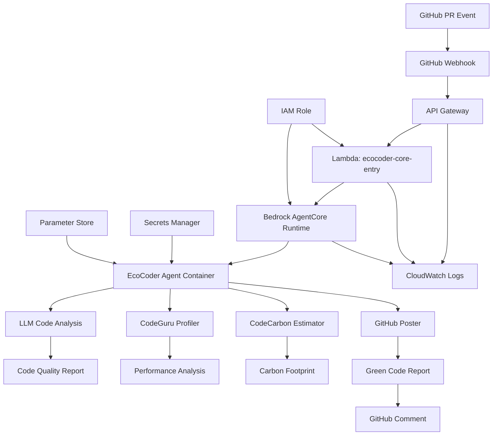

# EcoCoderAgentCore

> **Green Software Engineering AI Agent** - Sustainable code analysis powered by AWS and Strands SDK

[](https://github.com/your-org/EcoCoderAgentCore/actions)
[](https://codecov.io/gh/your-org/EcoCoderAgentCore)
[](https://opensource.org/licenses/MIT)

## Overview

EcoCoderAgentCore is an intelligent AI agent that analyzes GitHub pull requests for environmental sustainability and code quality. Built with the Strands SDK and deployed on AWS Bedrock AgentCore Runtime, it provides comprehensive "Green Code Reports" that help developers write more sustainable software.

### Key Features

- 🌱 **Carbon Footprint Analysis** - Calculate CO2 emissions from code performance
- 🔍 **Code Quality Review** - Modern LLM-based static analysis for comprehensive code review
- ⚡ **Enhanced Performance Profiling** - AI-powered test discovery with real CodeBuild execution and CodeGuru Profiler integration
- 🤖 **AI Test Discovery** - Automatically finds and runs relevant test scripts from PR changes
- 📊 **Automated Reporting** - Post detailed analysis to GitHub pull requests
- 🚀 **Scalable Architecture** - Container-based deployment with AWS AgentCore for the Agent and tools; and SAM based deployment for API Gateway and Lambds
- 🔒 **Enterprise Ready** - IAM roles, secrets management, monitoring included

## Architecture

### Infrastructure Overview



### AWS Components

- **API Gateway**: HTTP endpoint for GitHub webhooks with CORS support
- **Lambda Function**: `ecocoder-core-entry` - webhook processor and AgentCore bridge
- **Bedrock AgentCore Runtime**: Managed container runtime for the AI agent
- **IAM Roles**: Least-privilege access for Lambda and AgentCore
- **CloudWatch**: Comprehensive logging and monitoring
- **Secrets Manager**: Secure storage for GitHub tokens and webhook secrets

### Enhanced Performance Profiling 🚀

EcoCoder features an **AI-powered performance profiler** that goes beyond traditional static analysis by actually executing your code changes:

#### How It Works

1. **📋 PR Analysis**: Extracts changed files from GitHub PR payload
2. **🤖 AI Test Discovery**: Uses intelligent heuristics to find relevant test scripts:
   - Analyzes file patterns (`test_*.py`, `*_test.py`, etc.)
   - Maps source files to their corresponding tests
   - Discovers integration and end-to-end tests
   - Calculates confidence scores for test relevance

3. **🏗️ CodeBuild Execution**: Runs discovered tests in AWS CodeBuild with:
   - CodeGuru Profiler agent enabled for real-time profiling
   - Proper build environment with language-specific setup
   - Isolated execution for accurate performance measurement

4. **📊 Performance Analysis**: Provides comprehensive insights:
   - CPU bottlenecks with function-level detail
   - Memory usage patterns and optimization opportunities
   - Performance grades (A-F) based on execution metrics
   - Actionable recommendations with priority levels

#### Key Advantages

- **Real Performance Data**: Unlike static analysis, measures actual execution performance
- **Zero Configuration**: Automatically discovers and runs relevant tests
- **Language Aware**: Supports Python, JavaScript, Java with framework-specific commands
- **Comprehensive Results**: Combines profiling data with AI-generated optimization recommendations
- **Robust Error Handling**: Gracefully handles GitHub API issues, build failures, and missing tests

#### Example Output

```json
{
  "status": "completed",
  "pr_analysis": {
    "files_changed": 3,
    "languages": ["python"],
    "total_changes": 156
  },
  "test_discovery": {
    "tests_discovered": 8,
    "confidence_score": 0.85,
    "test_frameworks": ["pytest"]
  },
  "performance_insights": {
    "performance_grade": "B",
    "cpu_performance_score": 0.78,
    "optimization_opportunities": [
      "Algorithm optimization needed",
      "Consider caching frequently called functions"
    ]
  }
}
```
- **Parameter Store**: Configuration management for agent settings

### Components

- **Agent Core** (`app/agent.py`) - Strands SDK integration and orchestration
- **Tools** (`app/tools/`) - Four specialized analysis tools
- **Utilities** (`app/utils/`) - AWS helpers, GitHub API, validation
- **Container** - Docker deployment with AgentCore configuration

## Quick Start

### Prerequisites

- AWS Account with appropriate permissions
- AWS CLI configured (`aws configure`)
- AWS SAM CLI installed
- GitHub repository with webhook access
- Python 3.11+ for local development
- The agent utilises bedrock-agentcore-starter-toolkit as documented here https://github.com/aws/bedrock-agentcore-starter-toolkit

### 1. Clone and Setup

```bash
git clone https://github.com/your-org/EcoCoderAgentCore.git
cd EcoCoderAgentCore

# Create virtual environment
python -m venv venv
source venv/bin/activate  # On Windows: venv\Scripts\activate

# Install dependencies
pip install -r requirements.txt
```

### 2. Configure Environment

```bash
# Copy example environment file
cp .env.example .env

# Edit with your AWS and GitHub settings
vim .env
```

Required environment variables:
```bash
AWS_REGION=ap-southeast-1
GITHUB_TOKEN_SECRET_NAME=ecocoder/github-token
WEBHOOK_SECRET_NAME=ecocoder/webhook-secret
LOG_LEVEL=INFO
```

### 3. AWS Setup

#### Create Secrets in AWS Secrets Manager:

```bash
# GitHub Personal Access Token
aws secretsmanager create-secret \
  --name "ecocoder/github-token" \
  --description "GitHub PAT for EcoCoder agent" \
  --secret-string '{"github_token":"your_github_pat_here"}'

# Webhook Secret
aws secretsmanager create-secret \
  --name "ecocoder/webhook-secret" \
  --description "GitHub webhook secret" \
  --secret-string '{"webhook_secret":"your_webhook_secret_here"}'
```

#### Set Parameters in Systems Manager:

```bash
# Carbon intensity data for regions
aws ssm put-parameter \
  --name "/ecocoder/carbon-intensity/ap-southeast-1" \
  --value "0.4" \
  --type "String" \
  --description "Carbon intensity for AP Southeeast 1"

aws ssm put-parameter \
  --name "/ecocoder/config/profiling-duration" \
  --value "300" \
  --type "String" \
  --description "CodeGuru profiling duration in seconds"
```

#### Configure Agent Permissions:

After deploying your AgentCore runtime with `agentcore launch`, run the permissions setup script:

```bash
# Configure all required permissions (Memory + CodeGuru)
./scripts/setup-permissions.sh

# Or legacy memory-only setup  
./scripts/setup-memory-permissions.sh
```

This script will:
- Find your AgentCore runtime role automatically
- Attach Bedrock AgentCore memory permissions
- Attach CodeGuru Profiler permissions
- Configure access to Systems Manager and Secrets Manager

### 4. Local Development

```bash
# Run in development mode
python -m app.agent
```

### 5. Deploy to AWS with SAM

#### Quick Deploy (Recommended):

```bash
# From root directory (using wrapper script)
./deploy_lambda.sh

# Deploy to staging
./deploy_lambda.sh staging

# Deploy to production
./deploy_lambda.sh prod

# OR navigate to Lambda directory directly
cd ecocoder_entry_lambda/
./deploy.sh
```

#### Manual Deploy:

```bash
# Navigate to Lambda directory
cd ecocoder_entry_lambda/

# Build SAM application
sam build

# Deploy with guided configuration (first time)
sam deploy --guided

# Deploy with existing configuration
sam deploy
```

#### Local Testing:

```bash
# From root directory (using wrapper script)
./test_lambda.sh

# OR navigate to Lambda directory directly
cd ecocoder_entry_lambda/
./test_local.sh

# Or manually start local API
cd ecocoder_entry_lambda/
sam local start-api --port 3000

# Test health endpoint locally
curl http://localhost:3000/health
```

## Usage

### GitHub Integration

1. **Deploy the Infrastructure**: 
  - Deploy Bedrock Agenctcore Runtime hosted agent
  Run 'agentcore configure' to configure your agent
  run agentcore launch to deploy the agent to aws environment
  run agentcore invoke to call the agent running in aws envrionment directly from your local machine

  Update the variable AgentArn in the SAM template.yaml file under ecocode_entry_lambda folder with the agent runtime arn

  - Deploy API Gateway and Lamba entry point
   ```bash
   ./deploy.sh
   ```
   
   The deployment will output the webhook URL you need for GitHub.
   Additional permission needed for the agent is defined in the setup-permission.sh file which also need to be executed

2. **Setup GitHub Webhook**: Configure GitHub webhook in your repository settings:
   - Payload URL: `https://your-api-gateway-id.execute-api.ap-southeast-1.amazonaws.com/dev/webhook`
   - Content type: `application/json`
   - Secret: Your webhook secret from AWS Secrets Manager (optional)
   - Events: Pull requests
   - SSL verification: Enable

3. **Pull Request Analysis**: When a PR is created or updated, the agent will:
   - Receive webhook via API Gateway
   - Forward to Lambda function (`ecocoder-core-entry`)
   - Invoke Bedrock AgentCore Runtime
   - Analyze code quality with LLM analysis
   - Profile performance characteristics
   - Calculate carbon footprint estimates
   - Post a comprehensive Green Code Report

### Sample Green Code Report

```markdown
## 🌱 Green Code Report

### 📊 Analysis Summary
- **Carbon Footprint**: 0.025 kg CO2 (equivalent to 0.1 miles driven)
- **Code Quality**: 3 recommendations found
- **Performance**: 2 optimization opportunities identified

### 🔍 Code Quality Issues
1. **High Severity**: Consider using more efficient algorithm in `process_data()`
2. **Medium**: Potential memory leak in loop at line 45

### ⚡ Performance Bottlenecks
- CPU hotspot in `expensive_operation()` (45% of execution time)
- Memory allocation pattern could be optimized

### 🌍 Environmental Impact
- Estimated energy consumption: 0.05 kWh
- Regional carbon intensity (us-east-1): 0.4 kg CO2/kWh
- Suggestions for improvement:
  - Optimize algorithmic complexity
  - Reduce redundant computations
  - Consider caching strategies

### 📈 Recommendations
1. **Immediate**: Fix the algorithm in `process_data()` method
2. **Short-term**: Implement result caching to reduce CPU usage
3. **Long-term**: Consider migrating to greener AWS regions

---
*Report generated by EcoCoderAgentCore v1.0.0*
```

## Configuration

### Agent Configuration

The agent behavior can be customized through environment variables and AWS Parameter Store:

```yaml
# .bedrock_agentcore.yaml
spec:
  environment:
    - name: AWS_REGION
      value: "us-east-1"
    - name: LOG_LEVEL  
      value: "INFO"
    - name: PROFILING_DURATION
      value: "300"
```

### Tool Configuration

Each tool can be configured independently:

- **LLM Code Analysis**: Analysis depth, model selection, prompt customization
- **CodeGuru Profiler**: Duration, sampling rate, flame graph options
- **CodeCarbon**: Regional intensity, calculation method
- **GitHub Poster**: Comment format, update behavior

## Development

### Project Structure

```
EcoCoderAgentCore/
├── app/
│   ├── agent.py              # Main agent entrypoint
│   ├── tools/                # Analysis tools
│   │   ├── llm_code_reviewer.py
│   │   ├── codeguru_profiler.py
│   │   ├── codecarbon_estimator.py
│   │   └── github_poster.py
│   ├── utils/                # Utility modules
│   │   ├── aws_helpers.py
│   │   ├── github_helpers.py
│   │   └── validation.py
│   └── prompts/
│       └── system_prompt.md  # Agent instructions
├── ecocoder_entry_lambda/    # Complete Lambda SAM application
│   ├── lambda_webhook_bridge.py # Main Lambda handler
│   ├── requirements.txt      # Lambda dependencies
│   ├── template.yaml        # AWS SAM template
│   ├── samconfig.toml       # SAM configuration
│   ├── deploy.sh           # Deployment script
│   ├── test_local.sh      # Local testing script
│   ├── cleanup.sh         # Resource cleanup script
│   ├── hooks/             # SAM deployment hooks
│   │   ├── pretraffic.py  # Pre-deployment validation
│   │   └── posttraffic.py # Post-deployment validation
│   ├── test_events/       # Lambda test events
│   │   ├── health_check.json
│   │   ├── webhook_pr_opened.json
│   │   ├── cors_preflight.json
│   │   └── test_pr_payload.json
│   └── README.md         # Lambda documentation
├── tests/                 # Test suite
├── .github/
│   └── workflows/
│       └── ci-cd.yml     # CI/CD pipeline
├── deploy_lambda.sh      # Root-level deployment wrapper
├── test_lambda.sh       # Root-level testing wrapper
├── Dockerfile            # Container configuration
├── .bedrock_agentcore.yaml # AgentCore deployment config
└── requirements.txt      # Python dependencies
```

### Running Tests

```bash
# Install test dependencies
pip install pytest pytest-cov pytest-mock moto

# Run all tests
pytest tests/ -v

# Run with coverage
pytest tests/ --cov=app --cov-report=html

# Run specific test file
pytest tests/test_agent.py -v
```

### Code Quality

```bash
# Format code
black app/ tests/

# Sort imports
isort app/ tests/

# Lint
flake8 app/ tests/

# Type checking
mypy app/ --ignore-missing-imports
```

For local development without some of live services:

export 'ENVIRONMENT' = 'development'

```bash
python -m app.agent
```

This provides:
- Simulated AWS API responses
- Fake GitHub webhooks
- Sample analysis results
- Local testing capabilities

## Monitoring and Observability

### CloudWatch Metrics

The agent automatically publishes metrics to CloudWatch:

- `ProcessedPullRequests` - Number of PRs analyzed
- `AnalysisLatency` - Time to complete analysis
- `ErrorRate` - Rate of analysis failures
- `CarbonFootprintCalculated` - Total CO2 estimates generated

## Security

### IAM Permissions

Example IAM policy for the agent:

```json
{
  "Version": "2012-10-17",
  "Statement": [
    {
      "Effect": "Allow",
      "Action": [
        "bedrock:InvokeModel",
        "bedrock:InvokeModelWithResponseStream"
      ],
      "Resource": "arn:aws:bedrock:*::foundation-model/*"
    }
  ]
}
```

### Secrets Management

- GitHub tokens stored in AWS Secrets Manager
- Webhook secrets encrypted at rest
- No sensitive data in container images or logs

### Network Security

- Container runs as non-root user
- Outbound HTTPS connections only
- VPC endpoints for AWS service communication (optional)

## Troubleshooting

### Common Issues

**1. Agent not receiving webhooks**
```bash
# Check AgentCore endpoint status
aws bedrock-agentcore describe-agent --agent-name ecocoder-agent-core

# Verify GitHub webhook configuration
curl -X POST https://your-endpoint/webhook/github \
  -H "Content-Type: application/json" \
  -d '{"action":"ping"}'
```

**2. AWS permission errors**
```bash
# Test AWS credentials
aws sts get-caller-identity

# Check Bedrock permissions
aws bedrock list-foundation-models
```

**3. CodeGuru Profiler permission issues**
If you see the error "Permission limitations prevented performance profiling":

```bash
# Run the comprehensive permissions setup script
./scripts/setup-permissions.sh

# This will configure both memory and CodeGuru Profiler permissions
# Alternatively, run the legacy memory-only script:
./scripts/setup-memory-permissions.sh
```

The issue occurs when the AgentCore runtime role lacks required CodeGuru Profiler permissions:
- `codeguru-profiler:GetProfile`
- `codeguru-profiler:GetRecommendations` 
- `codeguru-profiler:DescribeProfilingGroup`

**4. Individual permission debugging**
```bash
# Test CodeGuru Profiler access
aws codeguru-profiler list-profiling-groups

# Test Bedrock access  
aws bedrock list-foundation-models

# Check Systems Manager access
aws ssm get-parameter --name "/ecocoder/config/profiling-duration"
```

### Debugging

Enable debug logging:
```bash
export LOG_LEVEL=DEBUG
```

### Development Guidelines

- Follow PEP 8 style guidelines
- Add tests for new functionality
- Update documentation for API changes
- Ensure all CI checks pass

## Roadmap

- [ ] Multi-language support (Java, JavaScript, etc.)
- [ ] Integration with additional static analysis tools
- [ ] Real-time carbon intensity data integration
- [ ] Machine learning model for sustainability predictions
- [ ] IDE plugins and browser extensions
- [ ] Enterprise dashboard and analytics

---

**Built with 🌱 for a more sustainable future in software development**

Architecture diagram available here: https://drive.google.com/file/d/1dNF71SL0Ref4Ui1-O_MGV_pG0VAoPYgE/view?usp=sharing