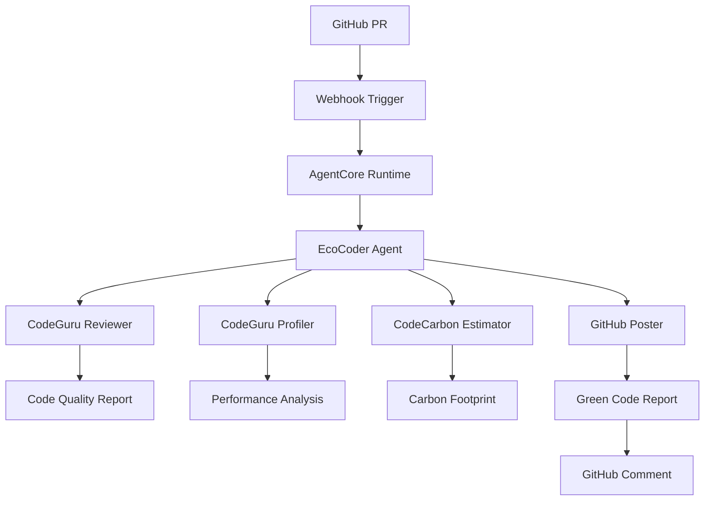

# EcoCoderAgentCore

> **Green Software Engineering AI Agent** - Sustainable code analysis powered by AWS and Strands SDK

[](https://github.com/your-org/EcoCoderAgentCore/actions)
[](https://codecov.io/gh/your-org/EcoCoderAgentCore)
[](https://opensource.org/licenses/MIT)

## Overview

EcoCoderAgentCore is an intelligent AI agent that analyzes GitHub pull requests for environmental sustainability and code quality. Built with the Strands SDK and deployed on AWS Bedrock AgentCore Runtime, it provides comprehensive "Green Code Reports" that help developers write more sustainable software.

### Key Features

- 🌱 **Carbon Footprint Analysis** - Calculate CO2 emissions from code performance
- 🔍 **Code Quality Review** - Static analysis using Amazon CodeGuru Reviewer
- ⚡ **Performance Profiling** - Identify bottlenecks with CodeGuru Profiler  
- 📊 **Automated Reporting** - Post detailed analysis to GitHub pull requests
- 🚀 **Scalable Architecture** - Container-based deployment with AWS AgentCore
- 🔒 **Enterprise Ready** - IAM roles, secrets management, monitoring included

## Architecture



### Components

- **Agent Core** (`app/agent.py`) - Strands SDK integration and orchestration
- **Tools** (`app/tools/`) - Four specialized analysis tools
- **Utilities** (`app/utils/`) - AWS helpers, GitHub API, validation
- **Container** - Docker deployment with AgentCore configuration

## Quick Start

### Prerequisites

- AWS Account with appropriate permissions
- GitHub repository with webhook access
- Python 3.11+ for local development
- Docker for containerization

### 1. Clone and Setup

```bash
git clone https://github.com/your-org/EcoCoderAgentCore.git
cd EcoCoderAgentCore

# Create virtual environment
python -m venv venv
source venv/bin/activate  # On Windows: venv\Scripts\activate

# Install dependencies
pip install -r requirements.txt
```

### 2. Configure Environment

```bash
# Copy example environment file
cp .env.example .env

# Edit with your AWS and GitHub settings
vim .env
```

Required environment variables:
```bash
AWS_REGION=ap-southeast-1
GITHUB_TOKEN_SECRET_NAME=ecocoder/github-token
WEBHOOK_SECRET_NAME=ecocoder/webhook-secret
LOG_LEVEL=INFO
MOCK_MODE=false  # Set to true for local development
```

### 3. AWS Setup

#### Create Secrets in AWS Secrets Manager:

```bash
# GitHub Personal Access Token
aws secretsmanager create-secret \
  --name "ecocoder/github-token" \
  --description "GitHub PAT for EcoCoder agent" \
  --secret-string '{"github_token":"your_github_pat_here"}'

# Webhook Secret
aws secretsmanager create-secret \
  --name "ecocoder/webhook-secret" \
  --description "GitHub webhook secret" \
  --secret-string '{"webhook_secret":"your_webhook_secret_here"}'
```

#### Set Parameters in Systems Manager:

```bash
# Carbon intensity data for regions
aws ssm put-parameter \
  --name "/ecocoder/carbon-intensity/us-east-1" \
  --value "0.4" \
  --type "String" \
  --description "Carbon intensity for US East 1"

aws ssm put-parameter \
  --name "/ecocoder/config/profiling-duration" \
  --value "300" \
  --type "String" \
  --description "CodeGuru profiling duration in seconds"
```

### 4. Local Development

```bash
# Run in mock mode for development
export MOCK_MODE=true
python -m app.agent
```

### 5. Deploy to AWS

#### Build and Push Container:

```bash
# Build Docker image
docker build -t ecocoder-agent-core .

# Tag and push to ECR
aws ecr get-login-password --region us-east-1 | docker login --username AWS --password-stdin 123456789012.dkr.ecr.us-east-1.amazonaws.com
docker tag ecocoder-agent-core:latest 123456789012.dkr.ecr.us-east-1.amazonaws.com/ecocoder-agent-core:latest
docker push 123456789012.dkr.ecr.us-east-1.amazonaws.com/ecocoder-agent-core:latest
```

#### Deploy with AgentCore:

```bash
# Deploy using AgentCore CLI
aws bedrock-agentcore deploy \
  --agent-name ecocoder-agent-core \
  --config-file .bedrock_agentcore.yaml \
  --image-uri 123456789012.dkr.ecr.us-east-1.amazonaws.com/ecocoder-agent-core:latest
```

## Usage

### GitHub Integration

1. **Setup Webhook**: Configure GitHub webhook in your repository settings:
   - Payload URL: `https://your-agent-endpoint/webhook/github`
   - Content type: `application/json`
   - Secret: Your webhook secret from AWS Secrets Manager
   - Events: Pull requests

2. **Pull Request Analysis**: When a PR is created or updated, the agent will:
   - Analyze code quality with CodeGuru Reviewer
   - Profile performance characteristics
   - Calculate carbon footprint estimates
   - Post a comprehensive Green Code Report

### Sample Green Code Report

```markdown
## 🌱 Green Code Report

### 📊 Analysis Summary
- **Carbon Footprint**: 0.025 kg CO2 (equivalent to 0.1 miles driven)
- **Code Quality**: 3 recommendations found
- **Performance**: 2 optimization opportunities identified

### 🔍 Code Quality Issues
1. **High Severity**: Consider using more efficient algorithm in `process_data()`
2. **Medium**: Potential memory leak in loop at line 45

### ⚡ Performance Bottlenecks
- CPU hotspot in `expensive_operation()` (45% of execution time)
- Memory allocation pattern could be optimized

### 🌍 Environmental Impact
- Estimated energy consumption: 0.05 kWh
- Regional carbon intensity (us-east-1): 0.4 kg CO2/kWh
- Suggestions for improvement:
  - Optimize algorithmic complexity
  - Reduce redundant computations
  - Consider caching strategies

### 📈 Recommendations
1. **Immediate**: Fix the algorithm in `process_data()` method
2. **Short-term**: Implement result caching to reduce CPU usage
3. **Long-term**: Consider migrating to greener AWS regions

---
*Report generated by EcoCoderAgentCore v1.0.0*
```

## Configuration

### Agent Configuration

The agent behavior can be customized through environment variables and AWS Parameter Store:

```yaml
# .bedrock_agentcore.yaml
spec:
  environment:
    - name: AWS_REGION
      value: "us-east-1"
    - name: LOG_LEVEL  
      value: "INFO"
    - name: PROFILING_DURATION
      value: "300"
```

### Tool Configuration

Each tool can be configured independently:

- **CodeGuru Reviewer**: Timeout, analysis type, rule sets
- **CodeGuru Profiler**: Duration, sampling rate, flame graph options
- **CodeCarbon**: Regional intensity, calculation method
- **GitHub Poster**: Comment format, update behavior

## Development

### Project Structure

```
EcoCoderAgentCore/
├── app/
│   ├── agent.py              # Main agent entrypoint
│   ├── tools/                # Analysis tools
│   │   ├── codeguru_reviewer.py
│   │   ├── codeguru_profiler.py
│   │   ├── codecarbon_estimator.py
│   │   └── github_poster.py
│   ├── utils/                # Utility modules
│   │   ├── aws_helpers.py
│   │   ├── github_helpers.py
│   │   └── validation.py
│   └── prompts/
│       └── system_prompt.md  # Agent instructions
├── tests/                    # Test suite
├── .github/
│   └── workflows/
│       └── ci-cd.yml        # CI/CD pipeline
├── Dockerfile               # Container configuration
├── .bedrock_agentcore.yaml  # AgentCore deployment config
└── requirements.txt         # Python dependencies
```

### Running Tests

```bash
# Install test dependencies
pip install pytest pytest-cov pytest-mock moto

# Run all tests
pytest tests/ -v

# Run with coverage
pytest tests/ --cov=app --cov-report=html

# Run specific test file
pytest tests/test_agent.py -v
```

### Code Quality

```bash
# Format code
black app/ tests/

# Sort imports
isort app/ tests/

# Lint
flake8 app/ tests/

# Type checking
mypy app/ --ignore-missing-imports
```

### Mock Mode

For local development without AWS services:

```bash
export MOCK_MODE=true
python -m app.agent
```

Mock mode provides:
- Simulated AWS API responses
- Fake GitHub webhooks
- Sample analysis results
- Local testing capabilities

## Monitoring and Observability

### CloudWatch Metrics

The agent automatically publishes metrics to CloudWatch:

- `ProcessedPullRequests` - Number of PRs analyzed
- `AnalysisLatency` - Time to complete analysis
- `ErrorRate` - Rate of analysis failures
- `CarbonFootprintCalculated` - Total CO2 estimates generated

### Logs

Structured logs are sent to CloudWatch Logs:

```json
{
  "timestamp": "2024-01-15T10:30:00Z",
  "level": "INFO", 
  "message": "Analysis completed for PR #123",
  "pr_number": 123,
  "repository": "owner/repo",
  "carbon_footprint": 0.025,
  "duration_seconds": 45
}
```

### Alarms

Pre-configured CloudWatch alarms monitor:
- High error rates (>5%)
- High latency (>30s)
- Low success rates (<95%)

## Security

### IAM Permissions

The agent follows least-privilege principles:

```json
{
  "Version": "2012-10-17",
  "Statement": [
    {
      "Effect": "Allow",
      "Action": [
        "codeguru-reviewer:CreateCodeReview",
        "codeguru-reviewer:DescribeCodeReview",
        "codeguru-reviewer:ListRecommendations"
      ],
      "Resource": "*"
    }
  ]
}
```

### Secrets Management

- GitHub tokens stored in AWS Secrets Manager
- Webhook secrets encrypted at rest
- No sensitive data in container images or logs

### Network Security

- Container runs as non-root user
- Outbound HTTPS connections only
- VPC endpoints for AWS service communication (optional)

## Troubleshooting

### Common Issues

**1. Agent not receiving webhooks**
```bash
# Check AgentCore endpoint status
aws bedrock-agentcore describe-agent --agent-name ecocoder-agent-core

# Verify GitHub webhook configuration
curl -X POST https://your-endpoint/webhook/github \
  -H "Content-Type: application/json" \
  -d '{"action":"ping"}'
```

**2. AWS permission errors**
```bash
# Test AWS credentials
aws sts get-caller-identity

# Check CodeGuru permissions
aws codeguru-reviewer describe-code-review --code-review-arn "test"
```

**3. GitHub API rate limits**
```bash
# Check rate limit status
curl -H "Authorization: token YOUR_TOKEN" \
  https://api.github.com/rate_limit
```

### Debugging

Enable debug logging:
```bash
export LOG_LEVEL=DEBUG
```

Use mock mode for isolation:
```bash
export MOCK_MODE=true
```

## Contributing

1. Fork the repository
2. Create a feature branch: `git checkout -b feature/amazing-feature`
3. Commit changes: `git commit -m 'Add amazing feature'`
4. Push to branch: `git push origin feature/amazing-feature`
5. Open a Pull Request

### Development Guidelines

- Follow PEP 8 style guidelines
- Add tests for new functionality
- Update documentation for API changes
- Ensure all CI checks pass

## License

This project is licensed under the MIT License - see the [LICENSE](LICENSE) file for details.

## Support

- 📖 **Documentation**: [Full documentation](https://docs.ecocodercore.com)
- 🐛 **Issues**: [GitHub Issues](https://github.com/your-org/EcoCoderAgentCore/issues)
- 💬 **Discussions**: [GitHub Discussions](https://github.com/your-org/EcoCoderAgentCore/discussions)
- 📧 **Contact**: support@ecocodercore.com

## Roadmap

- [ ] Multi-language support (Java, JavaScript, etc.)
- [ ] Integration with additional static analysis tools
- [ ] Real-time carbon intensity data integration
- [ ] Machine learning model for sustainability predictions
- [ ] IDE plugins and browser extensions
- [ ] Enterprise dashboard and analytics

---

**Built with 🌱 for a more sustainable future in software development**